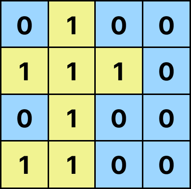

# Island Perimeter

## Problem Overview

The objective of this project is to calculate the perimeter of an island described by a 2D grid. The grid consists of land and water cells, where:
- `1` represents land.
- `0` represents water.

The goal is to compute the perimeter of the island formed by adjacent land cells (`1`), considering only horizontal and vertical connections (not diagonal). The perimeter is the total length of the outer edges of the land cells that are adjacent to water.


### Key Concepts

To solve this problem effectively, you should understand the following concepts:

#### 1. **2D Arrays (Matrices)**:
   - The grid is a list of lists (2D array) that represents the map. Navigating and manipulating this array is crucial.
   - Each element can be accessed using its row and column indices.

#### 2. **Conditional Logic**:
   - Each land cell (`1`) will contribute to the perimeter based on its neighbors. If a neighbor is water (`0`) or the edge of the grid, that side of the land cell contributes to the perimeter.

#### 3. **Counting**:
   - For each land cell, count the exposed edges that face water or the boundary of the grid. This involves checking each of the four neighboring cells (up, down, left, right).

---

### Parameters

- `grid` (List[List[int]]): A 2D list of integers representing the grid. Each cell is either `1` (land) or `0` (water).
  - The grid is surrounded entirely by water.
  - There is only one island (or no island at all) in the grid.
  - Example:
    ```python
    grid = [
        [0, 0, 0, 0, 0, 0],
        [0, 1, 0, 0, 0, 0],
        [0, 1, 0, 0, 0, 0],
        [0, 1, 1, 1, 0, 0],
        [0, 0, 0, 0, 0, 0]
    ]
    ```

### Return Value

- The function should return an integer representing the perimeter of the island.
  - The perimeter is calculated by counting the exposed edges of land cells.
  - If the grid contains no land, the perimeter should be `0`.
  
  Example:
  ```python
  island_perimeter(grid)
  # Output: 12

### Constraints

- The grid is a rectangular matrix with a maximum width and height of `100` cells.
- The grid is entirely surrounded by water, so there is no need to check for out-of-bound errors for cells adjacent to the grid's edge.
- There is only one island in the grid (if any), meaning the grid will contain no isolated water cells inside the land (no "lakes").
- The grid size is small enough (up to 100x100 cells) that an O(n*m) solution, where `n` is the number of rows and `m` is the number of columns, will run efficiently within the time constraints.
### Return Value

- The function returns an integer representing the perimeter of the island.
  - The perimeter is calculated by counting the exposed edges of land cells.
  - If the grid contains no land, the perimeter should be `0`.

Example:
```python
island_perimeter(grid)
# Output: 12
### Edge Cases

Consider the following edge cases when testing your solution:

1. **No Island (All Water)**
   - If the grid contains only water cells (`0`), the perimeter should be `0`.
   - Example:
     ```python
     grid = [
         [0, 0, 0],
         [0, 0, 0],
         [0, 0, 0]
     ]
     # Output: 0
     ```

2. **Single Cell Island**
   - If the grid contains only one land cell (`1`), the perimeter should be `4`.
   - Example:
     ```python
     grid = [
         [1]
     ]
     # Output: 4
     ```

3. **Island Touching Grid Edges**
   - If the island touches the edges of the grid, the exposed edges should be counted as part of the perimeter.
   - Example:
     ```python
     grid = [
         [1, 1],
         [0, 1]
     ]
     # Output: 6
     ```

4. **Large Island**
   - A larger island with a more complex shape to test the algorithm's efficiency and correctness.
   - Example:
     ```python
     grid = [
         [1, 1, 1, 0],
         [1, 0, 1, 1],
         [1, 1, 1, 1],
         [0, 1, 0, 1]
     ]
     # Output: 12
     ```

5. **Small Grid with a Complex Island Shape**
   - A smaller grid with an irregular island shape.
   - Example:
     ```python
     grid = [
         [1, 0, 1],
         [1, 1, 0],
         [0, 1, 1]
     ]
     # Output: 10
     ```

